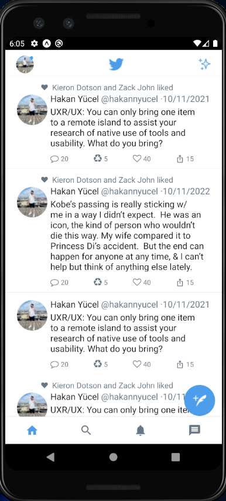
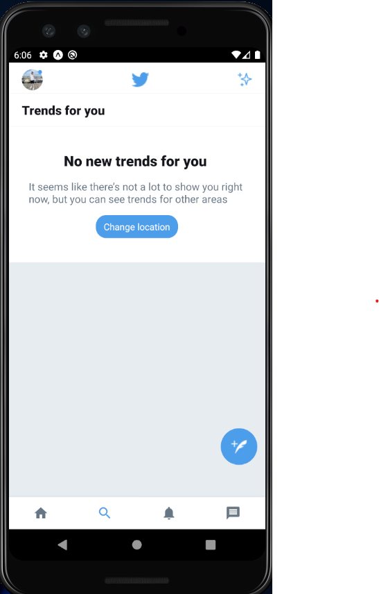
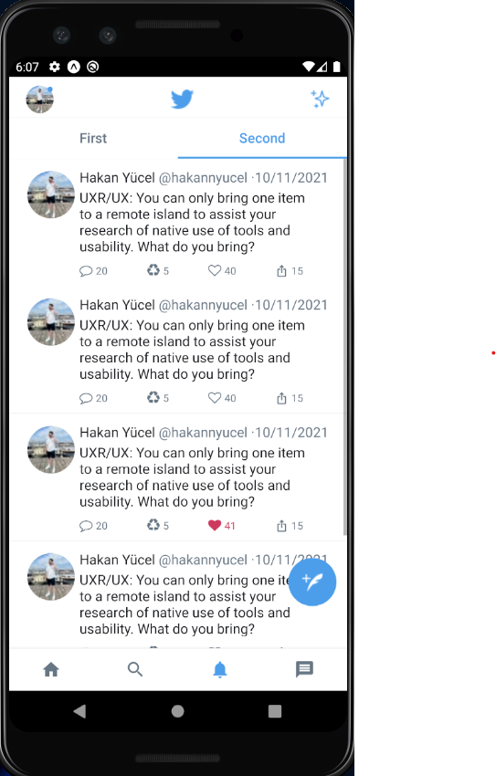

# Twitter Mobile Application

This project is a Twitter mobile application developed using React Native, TypeScript, and Expo.

## Demo Screenshots

<div style="display: flex; flex-wrap: no-wrap; gap: 30px; margin-bottom: 15px;">


</div>

<div style="display: flex; flex-wrap: no-wrap; gap: 30px;">


</div>

## Features

- Home: Displays users' tweets and real-time updates.
- Explore: Provides features for exploring popular tweets, trends, and recommended accounts.
- Notifications: Shows mentions, likes, and retweets received by the user.
- Messages: Enables users to chat with other users.
- Profile: Displays user account information, tweets, and follower/following counts.

## Installation

1. Clone this repository:

```bash
git clone https://github.com/hakannyucel/twitter-mobile-clone.git
```

2. Navigate to the project directory:

```bash
cd twitter-mobile-app
```

3. Install the required packages:

```bash
npm install
```

4. Start the Expo server:

```bash
expo start
```

5. Use an Android or iOS emulator or scan the QR code to run the application in Expo Go app on your development environment.

## Used Libraries

This project utilizes the following libraries:

- [react-native-reanimated](https://github.com/software-mansion/react-native-reanimated): Used for animations.
- [react-navigation](https://reactnavigation.org/): Used for screen navigation and routing.
- [react-native-screens](https://github.com/software-mansion/react-native-screens): Used to enhance performance for screen transitions.
- [react-native-vector-icons](https://github.com/oblador/react-native-vector-icons): Used for vector-based icons.

## Contributing

1. Fork and clone this repository locally:

```bash
git clone <FORKED_REPO_URL>
```

2. Create a new branch:

```bash
git checkout -b feature/your-feature-name
```

3. Commit your changes:

```bash
git commit -am 'Add some feature'
```

4. Push to your branch:

```bash
git push origin feature/your-feature-name
```

5. Open a pull request from your branch to the upstream repository.
